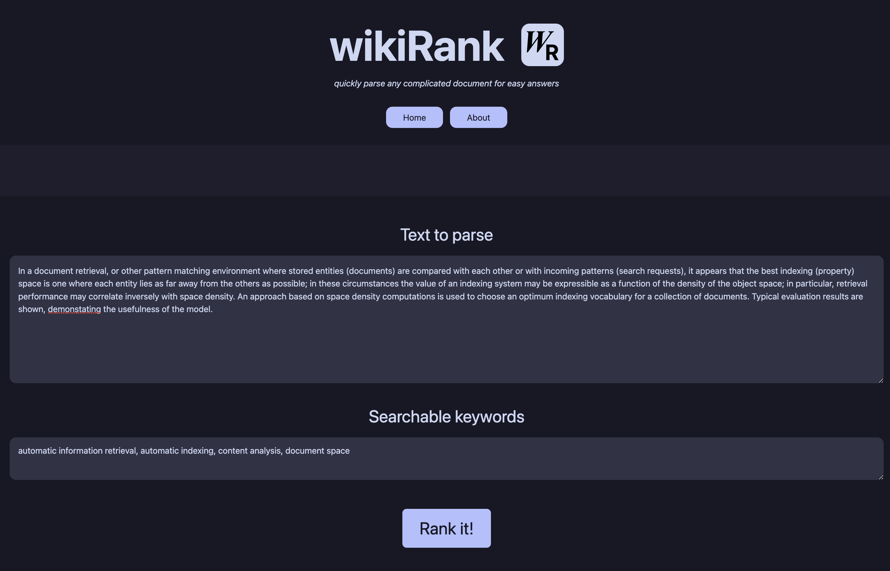
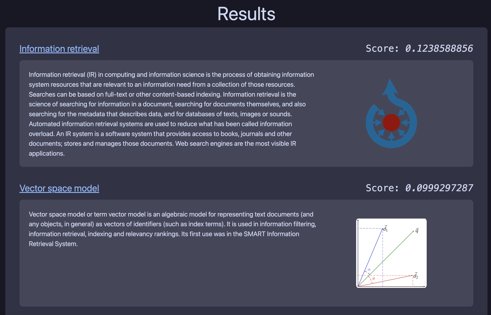

<div align="center">
  <a href="https://github.com/GeneralPoxter/wikiRank">
    
  </a>

  <h1 align="center">wikiRank</h1>

  <p align="center">
    A Wikipedia page ranker for research!
    <br />
    <a href="https://wikirank.vercel.app/"><strong>View Website</strong></a>
  </p>
</div>

## About

Can't understand a journal article? Feeling lost in a textbook chapter? Wikipedia is your friend &#8212; but it's so big! wikiRank analyzes your text and keywords to determine the most relevant Wikipedia pages using the vector space model. Happy learning!

## Local Deployment

1. **Start it**
    
    Install [npm](https://docs.npmjs.com/downloading-and-installing-node-js-and-npm), and run the following commands in your project directory's terminal:

    ```
    npm install
    npm run dev
    ```

2. **Check it out!**

    The project can be found at http://localhost:3000/

## User manual

Paste the reference text you want to study in first box, and paste the relevant comma-separated keywords (e.g. journal article keywords) in the second box:


Press the rank button and peruse the results below:


For more details, visit our [About](https://wikirank.vercel.app/about) page.

## Special Acknowledgements

Thank you to Luka Emeribe for the support and guidance! 

A NETS Group 69 creation, developed by
* [@aczw](https://github.com/aczw)
* [@GeneralPoxter](https://github.com/GeneralPoxter)
* [@geant04](https://github.com/geant04)
